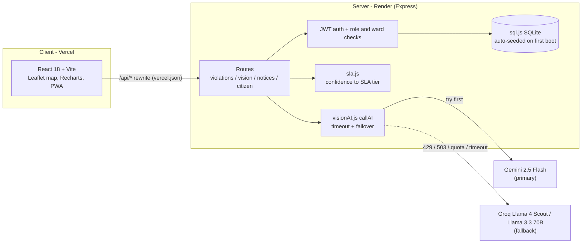

<div align="center">


# InfraWatch

**Satellite imagery in, SLA-tracked enforcement notice out.**
A vision-AI pipeline for flagging illegal construction in Indian municipal corporations, with confidence-based SLA routing, multi-provider AI failover, and a legal-notice generator constrained to a fixed statute list.

[](https://infrawatch-sepia.vercel.app)


Google Solution Challenge 2026 project, team of two. Prototype, not a validated deployment.

</div>

---

## Why

Bengaluru has an enormous stock of buildings and a small enforcement team, so detection-to-notice time is measured in weeks. InfraWatch explores closing that loop in software: a satellite tile goes to a vision model, a detection becomes a case with a response deadline, and the case gets a draft legal notice for an officer to review.

No pilot has been run, so there are **no impact or accuracy claims** here. Numbers that can be measured honestly are in [`eval/`](eval/README.md); vision accuracy is explicitly pending.

## Features

| Area | What the code does | Where |
|---|---|---|
| Vision analysis | Single-image and before/after analysis via Gemini; returns bounding boxes, violation type, confidence, risk level as JSON | `server/services/visionAI.js` |
| Confidence-based SLA | 4h if confidence >= 90, 12h if >= 80, else 24h; status ON_TIME / AT_RISK (past 80% of SLA) / BREACHED | `server/services/sla.js`, `server/routes/violations.js` |
| AI failover | Gemini primary; on 429 / quota / 503 / timeout the same request is retried on Groq (Llama 4 Scout for images, Llama 3.3 70B for text) | `visionAI.js` `callAI` |
| Legal notices | Draft notices from a prompt that restricts citations to a fixed statute list and tells the model to use a fallback phrase when unsure | `visionAI.js`, `gemini.js` |
| Case workflow | Roles (admin, commissioner, inspector, field officer), ward-scoped access, notice templates, activity log of case actions | `server/routes/*`, `server/middleware/*` |
| Crisis feed | Dashboard banner polling every 15 s for high-confidence unresolved cases and SLA breaches | `CrisisResponseBanner.jsx` |
| Citizen portal | Public, no-login report endpoint, in-memory limit of 5 reports/minute per IP | `server/routes/citizen.js` |
| Other | Case-review dossier, chat over a violation, compliance report, analytics, PWA shell, `/health` page | `server/routes/vision.js`, `analytics.js`, `client/` |

## Architecture



Vercel rewrites `/api/*` to the Render backend (`client/vercel.json`); locally, Vite proxies `/api` to the server.

## Design decisions

**Confidence-based SLA tiers.** Higher-confidence detections get shorter response deadlines, so scarce officer time goes to the likeliest true positives first. The mapping is a 10-line pure function (`sla.js`) so it is testable; boundary and monotonicity tests are in `eval/`. Known rough edges, documented rather than hidden: the scale is implicitly 0-100 (a 0-1 fraction lands in the 24h tier), and the crisis feed lists cases from 85 while the 4h tier starts at 90.

**AI failover in one place.** Every vision/text call in `visionAI.js` goes through a single dispatcher with a per-call timeout (default 30 s, `AI_TIMEOUT_MS`). Only retryable errors (429, quota, 503, unavailable, timeout) trigger failover; a 400 surfaces immediately instead of burning the second provider. Verified against stubbed providers in `eval/tests/failover.test.js`. Limitation: the notice route in `gemini.js` uses one provider and does not fail over.

**Citation guardrail, two layers.** The prompt names the only statutes and sections the model may cite (Karnataka Municipal Corporations Act 1976 s.308/321/321A/322, BBMP Building Bye-laws 2003, Karnataka Town and Country Planning Act 1961) and instructs a fallback phrase when unsure. Prompts alone cannot prevent hallucination, so `server/services/citationGuard.js` also checks every AI-drafted notice against the allowlist and replaces any off-allowlist citation with the fallback phrase, reporting what it removed in `citationsRemoved`. Measured before/after: the app passed 20/20 fabricated citations through with no guard, and catches 20/20 with it (0/20 false positives on valid text; synthetic fixtures, not a claim about real model hallucination rates). Every notice is still a draft for officer review, and the allowlist has not been verified against the statutes by a lawyer.

## Run locally

Requires Node >= 18 (Render config pins 20.11.1). A free Gemini key is optional for browsing the seeded demo; AI calls need it.

```bash
git clone https://github.com/tchxm/Infrawatch.git && cd Infrawatch
npm install
(cd client && npm install)
(cd server && npm install)
cp server/.env.example server/.env      # add GEMINI_API_KEY (and optionally GROQ_API_KEY)
npm run dev                             # client :5173, server :3002
```

The database auto-seeds on first boot if empty: 214 synthetic violations across 15 wards, users, and notice templates. Seed login is printed by the seed script (`server/db/seed.js`). Run the eval with `cd eval && npm test` (after the `server` install).

Key env vars (`server/.env.example`): `AI_PROVIDER`, `GEMINI_API_KEY`, `GEMINI_MODEL`, `GROQ_API_KEY`, `GROQ_MODEL`, `JWT_SECRET`, `PORT`, `AI_TIMEOUT_MS`.

## Screenshots

<!-- TODO: add real screenshots to docs/screenshots/ and replace these placeholders -->
| Dashboard + crisis banner | Map view | Vision analysis |
|---|---|---|
| _TODO: docs/screenshots/dashboard.png_ | _TODO: docs/screenshots/map.png_ | _TODO: docs/screenshots/analysis.png_ |

| AI notice draft | Citizen report portal | Analytics |
|---|---|---|
| _TODO: docs/screenshots/notice.png_ | _TODO: docs/screenshots/citizen.png_ | _TODO: docs/screenshots/analytics.png_ |

## Known limitations

- The demo's "city scan" and hotspot detections come from **seeded canned results** (`server/routes/vision.js`, `getSeededDetection`), so demo detections are not live model output. Non-hotspot images do go to the model.
- The single-image prompt tells the model to flag something whenever buildings are visible, which likely biases toward false positives. Vision accuracy is **not measured** (pending labeled data, see `eval/`).
- Officer assignment: the UI text mentions round-robin, but no round-robin logic exists in the server code; `full-pipeline` assigns new cases to the requesting user, and manual assignment is via the violations API.
- Model defaults are inconsistent: `.env.example`/`render.yaml` use `gemini-2.5-flash`, but `gemini.js` hardcodes `gemini-2.0-flash` for its text path and `visionAI.js` falls back to `gemini-2.0-flash` if `GEMINI_MODEL` is unset.
- After a failover, the `_provider`/`_model` metadata on parsed vision results still says Gemini.
- Data is synthetic; sql.js persists to a local file, so hosted state is ephemeral on free tiers.

## My contributions

Mohammed Afnan (GitHub: [tchxm](https://github.com/tchxm)).

**What the git history supports** (fork `tchxm/Infrawatch` of `LordDevdeep/Infrawatch`; 9 commits total, 2 author identities):

- 4 commits authored as `Afnan <kariox364@gmail.com>` on 2026-07-18, all touching only `README.md` (documentation rewrite and fixes).
- 5 commits authored by `LordDevdeep` (2026-04-20 to 2026-05-03) including both "first commit" commits that contain the entire codebase (server, client, AI services) and a README rewrite.
- Work added in this fork after that: the `eval/` harness (SLA, failover, citation-guardrail and vision-eval tooling) and extraction of the SLA mapping into `server/services/sla.js` (behaviour-preserving).

**What the history does not show.** The upstream history contains no commits authored under the Afnan identity for `server/` or the AI integration layer. Backend and AI-layer work (provider failover, notice generation, SLA routing) may have been written by Mohammed and committed under the upstream owner's account (the code arrives in "first commit" imports), pair-programmed, or written by the co-author. **Git history cannot distinguish these, so this README does not claim authorship of specific modules.** Mohammed should replace this paragraph with an accurate first-person account.

<!-- TODO(Mohammed): fill in from memory, e.g. "I designed and implemented X in server/services/... (paired with Y)". Only list what you can defend in an interview. -->

## Evaluation

See [`eval/README.md`](eval/README.md) for methodology and results: SLA routing (9/9 boundary cases, monotone over a 201-point sweep), failover (7/7 scenarios behave as designed with stubbed providers), citation guardrail (app-side catch 0/20 before the guard was added, 20/20 after; 0/20 false positives on synthetic fixtures), and vision accuracy (**pending**, harness and labeling template included).

## License

MIT, see [LICENSE](LICENSE). Upstream: [LordDevdeep/Infrawatch](https://github.com/LordDevdeep/Infrawatch).
